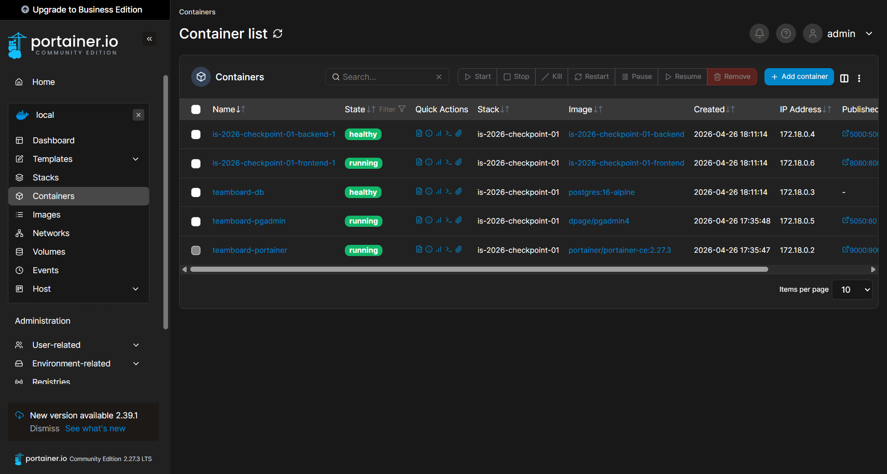

# IS-2026-checkpoint-01: TeamBoard App

## 📝 Descripción del Proyecto
TeamBoard es una aplicación web integrada diseñada para la gestión y visualización de equipos de desarrollo. El sistema permite visualizar de forma dinámica los integrantes del grupo, las funcionalidades implementadas y el estado de salud de cada servicio.

La arquitectura utiliza una red interna de Docker para conectar un frontend en Python, una API en Flask y una base de datos PostgreSQL, todo monitoreado mediante Portainer.

## 👥 Integrantes y Features
Conforme a los requisitos del trabajo práctico, cada integrante tiene asignada una feature única y crítica para el funcionamiento del producto final:

| Nombre y Apellido | Legajo | Feature | Responsabilidad |
|:---:|:---:|:---:|:---|
| **Julian Valentin Coloma Visconti** |  33214   | **01** | **Coordinación e Infraestructura Base**: Creación del repositorio, configuración de Docker Compose, gestión de variables de entorno y documentación base. |
| **Tomas Soler** |  33378  | **02** | **Frontend**: Interfaz de usuario dinámica en HTML/JS servida por un servidor HTTP de Python. |
| **Hajime Shiroma** |  31113  | **03** | **Backend**: API REST desarrollada en Flask que actúa como puente entre la DB y el frontend. |
| **Lucas Ignacio Modernell** |  33364  | **04** | **Database**: Persistencia de datos con PostgreSQL y script de inicialización de tablas. |
| **Tomas Rosato** | 33280  | **05** | **Monitoreo**: Implementación y configuración de Portainer para la gestión visual de la infraestructura. |
| **Mariano Salas** |  32758  | **06** | **Gestión de Datos (pgAdmin)**: Implementación de una interfaz gráfica para la administración, monitoreo y ejecución de queries sobre la base de datos PostgreSQL. |

## 🏗️ Arquitectura del Sistema
El proyecto utiliza una red interna de Docker para garantizar la comunicación aislada entre componentes:

* **Frontend (:8080)**: Consume datos del backend.
* **Backend (:5000)**: Procesa solicitudes y consulta la base de datos.
* **Database (Puerto Interno)**: PostgreSQL 16-alpine con volúmenes para persistencia de datos.
* **Portainer (:9000)**: Interfaz de administración conectada al socket de Docker.

## 🚀 Instrucciones de Ejecución

### Requisitos Previos
* Docker y Docker Compose instalados.
* Git para el control de versiones.

### Pasos para el despliegue
1.  **Clonar el repositorio:**
    ```bash
    git clone https://github.com/JulianColoma/is-2026-checkpoint-01.git
    cd is-2026-checkpoint-01
    ```
2.  **Configurar el entorno:**
    Copia el archivo de plantilla y configura las credenciales (el archivo `.env` está excluido de Git por seguridad):
    ```bash
    cp .env.example .env
    ```
3.  **Lanzar los servicios:**
    ```bash
    docker compose up -d --build
    ```
4.  **Verificación:**
    * Acceder a la App: `http://localhost:8080`.
    * Acceder a Portainer: `http://localhost:9000`.

### Feature 05 - Portainer

Se configuró Portainer CE como panel de monitoreo para visualizar y administrar los contenedores Docker del proyecto TeamBoard.

El servicio se define directamente en `docker-compose.yml`, utilizando la imagen `portainer/portainer-ce:2.27.3`. No requiere Dockerfile propio.

Portainer se comunica con Docker mediante el socket:

`/var/run/docker.sock`

Además, se configuró un volumen persistente llamado `portainer_data` para conservar la configuración del panel aunque el contenedor sea eliminado.

Para acceder:

- HTTP: `http://localhost:9000`

En el primer ingreso se crea un usuario administrador.


Luego de iniciar sesión, se selecciona la opción **Get Started** para administrar el entorno Docker local.


Desde el dashboard de Portainer se pueden visualizar los contenedores, imágenes, volúmenes, redes y el estado general de los servicios del proyecto (frontend, backend, database y pgAdmin), permitiendo verificar que todos los servicios se encuentran correctamente desplegados y en ejecución.



*Este proyecto fue desarrollado bajo las normativas de Ingeniería y Calidad de Software 2026 - UTN FRLP.*